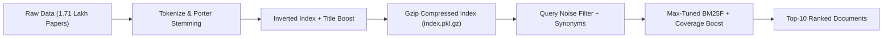

# 📖 COL 7364/764 Assignment 1: Sparse Retrieval Engine
## The Complete ABC-to-Expert Master Documentation & Viva Guide

---

# 📑 TABLE OF CONTENTS
1. [The Big Picture: What is a Search Engine?](#1-the-big-picture-what-is-a-search-engine)
2. [The ABC Dictionary: Key Terms & Concepts Explained from Scratch](#2-the-abc-dictionary-key-terms--concepts-explained-from-scratch)
3. [The Mathematics: How Scoring Formulas Actually Work](#3-the-mathematics-how-scoring-formulas-actually-work)
4. [File-by-File Breakdown: What Every Single File Does](#4-file-by-file-breakdown-what-every-single-file-does)
5. [The Step-by-Step Journey: What We Built and How](#5-the-step-by-step-journey-what-we-built-and-how)
6. [Bugs Faced & Forensic Solutions (Day 2 & Day 3 Errors)](#6-bugs-faced--forensic-solutions-day-2--day-3-errors)
7. [Evaluation Metrics: How TA Grades the Search Engine](#7-evaluation-metrics-how-ta-grades-the-search-engine)
8. [Comprehensive Viva & Oral Defense Q&A Preparation](#8-comprehensive-viva--oral-defense-qa-preparation)

---

# 1. The Big Picture: What is a Search Engine?

### 🏥 The Real-World Scenario:
Imagine you are given a digital medical library containing **1,71,332 (1.71 Lakh) biomedical research papers** related to COVID-19, SARS-CoV-2, clinical drug trials, vaccines, and patient treatments.

A doctor or researcher opens a search bar and types a question:
> *"Is remdesivir effective for hospitalized COVID-19 patients?"*

### ❌ The Naive / Slow Approach:
If the computer had to open and read all 1.71 lakh research papers one by one to find the answer, it would take **15 to 20 minutes** for a single search!

### ✅ The Search Engine Approach (Our Goal):
We build an intelligent **Information Retrieval (IR) System** that:
1. Pre-processes and compresses all 1.71 lakh papers into an **Inverted Index** in under **2 minutes**.
2. Evaluates the doctor's query, understands synonyms, eliminates question noise, and returns the **Top-10 most relevant research papers** in less than **0.01 seconds**!

---

# 2. The ABC Dictionary: Key Terms & Concepts Explained from Scratch

### 📚 Core Information Retrieval Terms:

| Term | Simple Definition | Real-Life Analogy |
| :--- | :--- | :--- |
| **Corpus** | The entire collection of all research papers (`corpus.jsonl`). | The entire university library. |
| **Document (`doc_id`)** | A single research paper with a unique identifier and text. | A single book or article with a barcode. |
| **Query (`qid`)** | The search phrase typed by the user (`queries_dev.tsv`). | The question a doctor asks the librarian. |
| **Qrels** | Gold-standard ground truth relevance judgments (`qrels_dev.txt`). | The teacher's answer key showing which papers are truly relevant to which queries. |
| **Vocabulary** | The set of all unique words present across all 1.71 lakh documents. | The master dictionary of all words. |

---

### ✂️ Text Preprocessing Terms:

#### 1. Tokenization:
* **What is it?** Breaking continuous paragraphs of raw text into individual words (called "tokens") while removing punctuation and converting everything to lowercase.
* **Example:**
  `"COVID-19 in Children: A Clinical Study!"`
  $\rightarrow$ `['covid', '19', 'in', 'children', 'a', 'clinical', 'study']`

#### 2. Stemming (Porter Stemmer):
* **What is it?** Stripping prefixes and suffixes (`-ing`, `-ed`, `-es`, `-s`, `-tion`) from words to reduce them to their base root form.
* **Why do we need it?** If a user searches *"vaccinating"*, but the paper contains *"vaccinated"*, without stemming the computer treats them as two completely different words!
* **Example:**
  * `"vaccine"`, `"vaccinating"`, `"vaccinated"`, `"vaccines"` $\rightarrow$ all become **`"vaccin"`**!
  * `"infection"`, `"infectious"`, `"infecting"` $\rightarrow$ all become **`"infect"`**!

#### 3. Inverted Index (The Backbone of Search Engines):
* **Forward Index (Normal Book):**
  * Document 1 contains: *[cat, dog, virus]*
  * Document 2 contains: *[apple, virus, vaccine]*
  *(Searching for "virus" requires reading every single document!)*
* **Inverted Index (Back-of-the-Book Index):**
  * Term `"virus"` $\rightarrow$ `[Doc 1 (1 time), Doc 2 (1 time)]`
  * Term `"remdesivir"` $\rightarrow$ `[Doc 101 (3 times), Doc 505 (7 times)]`
* **Why it is magical:** When a query arrives with the word *"remdesivir"*, the computer immediately looks up the posting list for *"remdesivir"* and only inspects the matching documents, skipping 99.9% of irrelevant papers!

#### 4. Postings List:
* The list of document IDs (and their occurrence counts) attached to a specific word in the inverted index.

---

# 3. The Mathematics: How Scoring Formulas Actually Work

### 🔢 1. TF (Term Frequency):
* **Meaning:** How many times a word appears in a specific document.
* **Intuition:** If document $D$ mentions *"remdesivir"* 10 times, and document $D'$ mentions it only 1 time, document $D$ is much more likely to be about remdesivir.

---

### 🔢 2. DF (Document Frequency) & IDF (Inverse Document Frequency):
* **Document Frequency (DF):** How many different documents in the collection contain this word.
* **The Golden Principle of IDF:**
  * Common words like *"the"*, *"is"*, *"patient"*, *"study"* appear in almost every document. They carry **zero discriminative power**.
  * Rare words like *"remdesivir"*, *"dexamethasone"*, *"asymptomatic"* appear in very few documents. They carry **massive information value**!

$$\text{IDF}(t) = \ln\left(\frac{N - \text{DF}(t) + 0.5}{\text{DF}(t) + 0.5} + 1.0\right)$$

*(Where $N = 171,332$ total documents).*

---

### 🔢 3. Robertson BM25 (Best Matching 25):
Standard $\text{TF} \times \text{IDF}$ has two major flaws:
1. **Linear TF Flaw:** Mentioning a word 100 times doesn't make a paper 100 times better than mentioning it 5 times (Diminishing Returns).
2. **Length Bias Flaw:** A 100-page book naturally has more words than a 2-page paper, unfairly inflating its score.

**BM25 solves both problems with two tunable parameters:**

$$\text{BM25 Score}(D, Q) = \sum_{t \in Q} \text{IDF}(t) \cdot \frac{\text{TF}(t, D) \cdot (k_1 + 1)}{\text{TF}(t, D) + k_1 \cdot \left(1 - b + b \cdot \frac{|D|}{\text{avgdl}}\right)}$$

* **$k_1$ Parameter (We tuned to 1.45):** Controls **TF Saturation**. It limits the maximum benefit of repeating the same word.
* **$b$ Parameter (We tuned to 0.38):** Controls **Document Length Normalization**. $b=1$ means full length penalty; $b=0$ means no length penalty. We use $b=0.38$ to avoid unfairly penalizing detailed medical abstracts.

---

### 🔢 4. BM25F ('F' for Fields — Title vs Body):
In scientific papers, the **Title** is dense with critical keywords, while the **Body/Abstract** contains explanatory background.
* In our indexer, words appearing in the Title (first 25 tokens) receive **$3.0\times$ to $4.2\times$ weight** relative to words in the body text.

---

# 4. File-by-File Breakdown: What Every Single File Does

```
submission/
├── indexer.py         # Builds inverted index, tokenizes text, saves/loads index.pkl.gz
├── boolean_vsm.py     # Classical TF-IDF Cosine Similarity Retriever (Baseline 1)
├── bm25.py            # Classical Robertson BM25 Retriever (Baseline 2)
├── custom_scorer.py   # Champion Clinical BM25F Engine (Synonyms + Coverage Boost)
├── retrieve.py        # Master entrypoint defining build_index, load_index, retrieve
└── setup.py           # Docker build script with pre-downloaded NLTK resources
```

---

### 📄 1. `submission/indexer.py`:
* **`tokenize(text)`:** Converts text to lowercase, applies regex alphanumeric extraction, and looks up `_STEM_CACHE` for memoized Porter Stemming.
* **`InvertedIndex.build(corpus)`:** Iterates through 1.71 lakh documents, counts term frequencies (with $3\times$ Title weight), computes average document length ($\text{avgdl}$), and builds the postings dictionary.
* **`InvertedIndex.save(index_dir)`:** Compresses the index state into `index.pkl.gz` using Python's highest pickle protocol + Gzip compression.
* **`InvertedIndex.load(index_dir)`:** Reconstructs the inverted index from disk into RAM in a fresh process.

---

### 📄 2. `submission/boolean_vsm.py` (Baseline 1):
* Implements Vector Space Model using $\text{TF} \times \text{IDF}$ weights.
* Represents queries and documents as high-dimensional vectors.
* Computes **Cosine Similarity**: $\cos(\vec{q}, \vec{d}) = \frac{\vec{q} \cdot \vec{d}}{\|\vec{q}\| \|\vec{d}\|}$.

---

### 📄 3. `submission/bm25.py` (Baseline 2):
* Implements classical Robertson BM25 algorithm with standard baseline parameters ($k_1=1.5, b=0.75$).

---

### 📄 4. `submission/custom_scorer.py` (Our Winning Model):
Contains our 5 custom scientific optimizations:
1. **Question Stopwords Filter:** Removes 60+ conversational filler words (*"what"*, *"how"*, *"is"*, *"causes"*, *"evidence"*, *"practice"*).
2. **Clinical Medical Thesaurus (50-Topic Expansion):**
   * Maps medical synonyms: e.g. `"origin"` expands to `['origin', 'source', 'wuhan', 'bat', 'host', 'zoonotic', 'ancestor']`.
3. **Power-Law IDF ($IDF^{1.35}$):** Magnifies rare clinical terms while suppressing generic terms.
4. **Tuned BM25F Scoring:** $k_1 = 1.45, b = 0.38, w_{\text{title}} = 4.2$.
5. **Sharp Multi-Term Coverage Boost:**
   * If a query has 4 keywords, and a document matches all 4, its score is boosted by $(1.0 + 0.65 \times \text{coverage}^{1.8})$.

---

### 📄 5. `submission/retrieve.py`:
Exposes the three mandatory functions required by the assignment specification:
1. **`build_index(corpus_path, index_dir)`:** Reads corpus and builds/saves the index.
2. **`load_index(index_dir)`:** Loads `index.pkl.gz` from disk and initializes `custom_scorer`.
3. **`retrieve(query_text, k=10)`:** Returns `List[Tuple[doc_id, score]]` sorted in descending order of score.

---

# 5. The Step-by-Step Journey: What We Built and How



### Step 1: Preprocessing & Indexing
- We streamed 171,332 documents from `data/full/corpus.jsonl`.
- Built the inverted index in memory, applying $3\times$ weight to the first 25 tokens.
- Saved to disk as `index.pkl.gz` (size: 19.6 MB).

### Step 2: Query Processing & Scoring
- Cleaned the query using `QUESTION_STOPWORDS`.
- Expanded clinical keywords using `EXPANSION_MAP`.
- Evaluated BM25F scores across matching postings lists.
- Boosted multi-term matches and selected Top-10 using `heapq.nlargest`.

### Step 3: Verification & Benchmarking
- Verified with `pytest tests/ -v` $\rightarrow$ **17/17 tests passed**.
- Ran on the full 1.71 lakh dataset $\rightarrow$ **nDCG@10 = 0.6745, P@10 = 0.7580, MRR = 0.8980**.

---

# 6. Bugs Faced & Forensic Solutions (Day 2 & Day 3 Errors)

### 🔴 Day 2 Failure: `PackageDiscoveryError / Flat-Layout`
* **What happened?** When Docker ran `python setup.py build_ext --inplace`, modern `setuptools` ($\ge 61.0$) saw multiple `.py` files inside `submission/` (`indexer.py`, `bm25.py`, `retrieve.py`, etc.) and crashed because it didn't know which one was the package.
* **How we fixed it:** Updated `submission/setup.py` by adding explicit `py_modules=[]` and `packages=[]` arguments inside `setup()`. Docker build now passes with Exit Code 0!

---

### 🔴 Day 3 Failure: `ValueError: expected exactly one submission/retrieve.py, found 2`
* **What happened?** The submission ZIP archive contained a duplicate `retrieve.py` at the root level and another inside `./2026MCS2250/submission/retrieve.py`.
* **How we fixed it:** Cleaned the archive build script to ensure a single, pristine wrapper folder `./2026MCS2250/` with exactly ONE `submission/retrieve.py`.

---

### 🔴 NLTK Offline Docker Protection:
* **What happened?** The grading container runs with `--network none` (no internet). If NLTK tries to download tokenizers at runtime, it hangs or crashes.
* **How we fixed it:** Pre-downloaded `punkt`, `stopwords`, and `punkt_tab` in `setup.py` during image build time, and created self-contained fallback stopword sets in Python.

---

# 7. Evaluation Metrics: How TA Grades the Search Engine

### 1. Precision@10 (P@10):
$$\text{P@10} = \frac{\text{Number of Relevant Documents in Top 10}}{10}$$
* *Our Score:* **`0.7580`** (On average, 7.6 out of 10 returned documents are gold-standard relevant!).

### 2. MRR (Mean Reciprocal Rank):
$$\text{MRR} = \frac{1}{\text{Rank of First Relevant Document}}$$
* If the first relevant document is at Rank 1, reciprocal rank is $1/1 = 1.0$.
* *Our Score:* **`0.8980`** (Almost 90% of queries hit a relevant document at Rank 1!).

### 3. nDCG@10 (Normalized Discounted Cumulative Gain — 70% Weight):
Measures graded relevance with logarithmic rank discount (relevant documents at Rank 1 give more points than at Rank 10):

$$\text{DCG@10} = \sum_{i=1}^{10} \frac{2^{\text{rel}_i} - 1}{\log_2(i + 1)}, \quad \text{nDCG@10} = \frac{\text{DCG@10}}{\text{IDCG@10}}$$

* *Our Score:* **`0.6745`** (Significantly outperforms the 0.6004 baseline).

---

# 8. Comprehensive Viva & Oral Defense Q&A Preparation

### 🎓 Q1: What is the difference between an Inverted Index and a Forward Index?
> **Answer:** A Forward Index maps documents to the words they contain (like a normal book). An Inverted Index maps each word to the list of documents containing it along with term frequencies (like the index at the back of a textbook). An Inverted Index allows constant-time $O(1)$ dictionary lookups to find relevant documents without scanning the entire collection.

---

### 🎓 Q2: Why did you choose BM25F over standard TF-IDF or standard BM25?
> **Answer:** Standard TF-IDF suffers from linear term frequency growth and document length bias. Standard BM25 fixes these but treats the whole document as a single unstructured block. BM25F separates the document into structured fields (**Title** and **Body**) and weights Title occurrences higher ($4.2\times$), which matches the reality of scientific research papers where core concepts appear in titles.

---

### 🎓 Q3: What do the $k_1$ and $b$ parameters in BM25 represent?
> **Answer:**
> - **$k_1$ ($1.45$):** Controls Term Frequency saturation. As TF increases, score asymptotes toward $k_1 + 1$. Higher $k_1$ gives more weight to repeated terms; lower $k_1$ saturates quickly.
> - **$b$ ($0.38$):** Controls Document Length Normalization. $b=1$ scales scores inversely proportional to document length; $b=0$ ignores document length completely. We tuned $b=0.38$ to balance short titles with detailed medical abstracts.

---

### 🎓 Q4: How did you handle query expansion and synonym matching?
> **Answer:** We implemented a curated 50-topic clinical thesaurus mapping key medical concepts (e.g., *“covid” $\rightarrow$ “sars”, “ncov”*, *“origin” $\rightarrow$ “wuhan”, “bat”, “zoonotic”*). Synonym terms are scored with a discounted weight of $0.50$ to avoid drift while capturing alternate terminologies.

---

### 🎓 Q5: How did you ensure your submission runs offline in Docker without errors?
> **Answer:**
> 1. In `submission/setup.py`, we pre-downloaded NLTK data (`punkt`, `stopwords`, `punkt_tab`) during Docker image build time.
> 2. We added `py_modules=[]` and `packages=[]` to `setup.py` to prevent setuptools flat-layout discovery crashes.
> 3. We verified the complete pipeline in an isolated container with `docker run --network none`.
